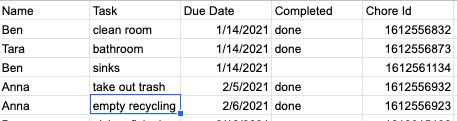

# task_reminder

## Project Motivation:
My roommates and I had a chore wheel, but it was ineffective. We got confused during holidays and no one wanted to tell someone else that they forgot to do a chore. To solve that, I wanted to create a simple system to keep track of chores or other regular tasks that would remind us automatically to do them.

## Project description:
Using google sheets we made a simple format that would allow us to plan out chores for the semester and input when we finished them. Then a script running weekly on my computer reads the sheet and texts each person reminding them of any outstanding tasks and the next one upcoming. By using google sheets, updates to the tasks list were accessible to everyone making it easy to use.

## Implementation specifics:
Using Launchd I scheduled a python script to run weekly - see example [here](./task_reminder_plist.xml).  Since I open my computer practically everyday, it feel more reasonable to use the StartCalendarInterval function than to run the script on a remote server. The script [reads in the google sheet](https://developers.google.com/sheets/api/quickstart/python), determines the tasks each person needs to do and formats a corresponding message in mime text. Then, with the [gmail API](https://developers.google.com/gmail/api/quickstart/python), the program sends an email to a cellphone number formatted with the appropriate extension based on the carrier. The carrier is determined with a request to a site and then I’ve hard coded several message extension for different providers. 

When running the google APIs run the quick start guides once and go through the authorization process.
 

## Future plans:
-stop the google oauth 2 warnings from filling up the log
-check the mimetext formatting and split into multiple texts messages that are too long to send in one message
-enable a reply feature so that people can indicate that they’ve done a chore in the text instead of using the gsheet \(I've already started this process by making each chore have an automatically generated unique ID based on the timestamp in epoch time. For an example of how to do that check out [my example](./google_sheets_unique_id.js) and [this guide](https://yagisanatode.com/2019/01/23/google-apps-script-adding-a-unique-id-in-a-cell-on-edit-of-an-adjacent-cell-using-time/)\). 
